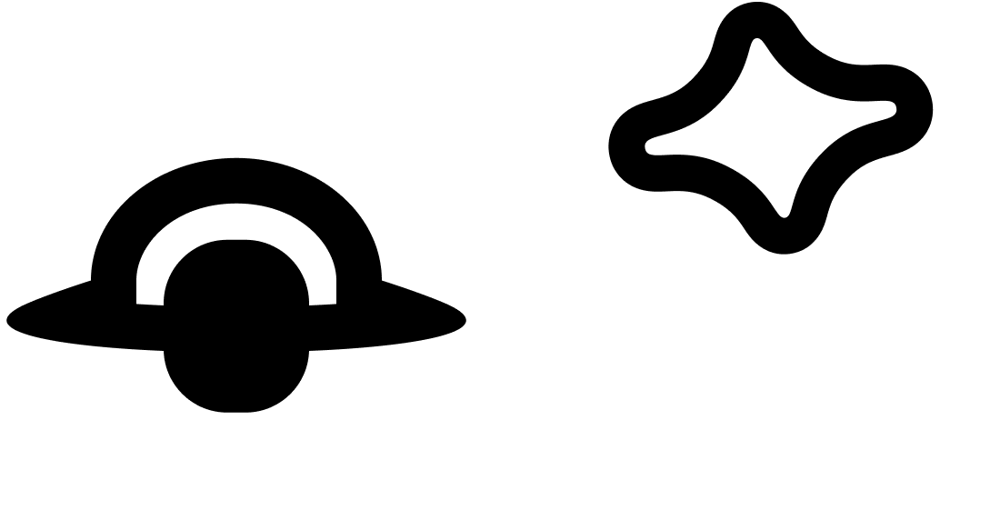
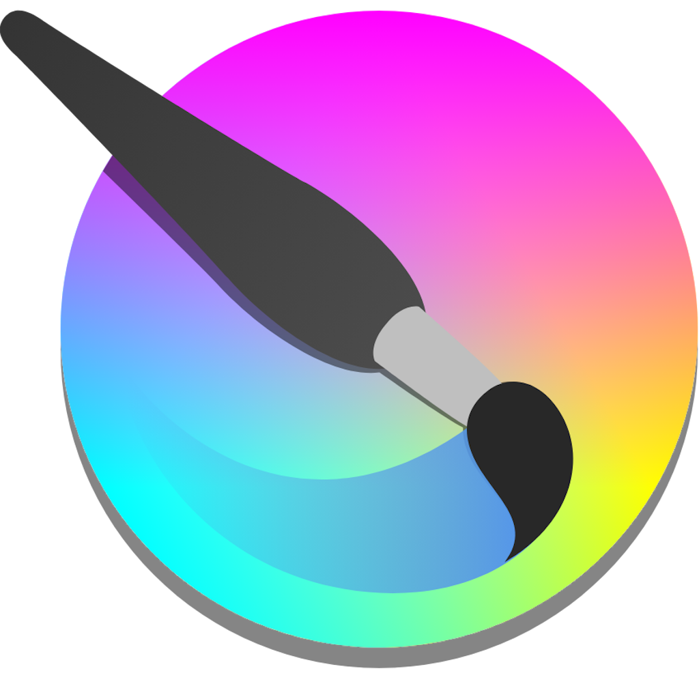

<p align="center">
    
</p>

<h1 align="center">
    Grand Horizon
</h1>

<p align="center">
    
    
    
    <br>
    Este projeto é um jogo desenvolvido em Unity que utiliza algoritmos de geração procedural para criar terrenos dinâmicos e únicos a cada nova partida. A geração do terreno é baseada em técnicas de ruído, como Perlin Noise, para garantir uma topografia natural e variada.
</p>

## ⚙️ Tecnologias Utilizadas
<sub></sub> **Unity**: Motor de jogo utilizado para o desenvolvimento. <br>
<sub></sub> **C#**: Linguagem de programação para scripts e lógica do jogo. <br>
<sub></sub> **Blender**: Ferramenta utilizada para a modelagem e animação de objetos 3D no jogo. <br>
<sub></sub> **Krita**: Software utilizado para a criação e edição de texturas e arte conceitual.

## 🚀 Setup

1. Clone o repositório:
    ```bash
    git clone https://github.com/Paulo092/procedural-chunk.git
    ```
1. Abra o projeto no Unity, iniciando o Unity Hub, clicando em `Add > Add Project From Disk` e selecionando o diretorio clonado no `passo 1`.
1. Abra o jogo, clicando em `procedural-chunk` na lista de projetos.
   - Talvez seja necessário instalar a versão correta da Unity para executá-lo.

## 🚧 Build

## 👥 Autores

<table align="center">
    <tr>
      <td align="center">
        <a href="https://github.com/Paulo092">
            <br>
              <b>Paulo Sergio</b>
        </a>
        <p>
          <sub>Programador/</sub><br>
          <sub>Game Designer</sub>
        </p>
    </td>
    <td align="center">
        <a href="https://github.com/Wellived">
            <br>
            <b>Guilherme Carvalho</b>
        </a>
        <p>
          <sub>Modelador/</sub><br>
          <sub>Animador</sub>
        </p>
    </td>
    <td align="center">
        <a href="https://github.com/Thiagoemanuell">
            <br>
            <b>Thiago Emanuell</b>
        </a>
        <p>
          <sub>Programador/</sub><br>
          <sub>Level Design</sub>
        </p>
    </td>
    <td align="center">
        <a href="https://github.com/marcelocpadovan">
            <br>
            <b>Marcelo Padovan</b>
        </a>
        <p>
          <sub>Gerente de projeto/</sub><br>
          <sub>Sound/EFX</sub>
        </p>
    </td>
    </tr>
</table>
